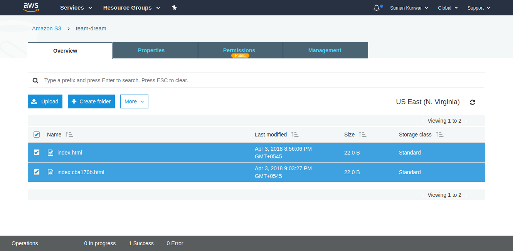

# react-deploy-cli

[](https://github.com/sumn2u/react-deploy-cli/issues) [](https://github.com/sumn2u/react-deploy-cli/network) [](https://github.com/sumn2u/react-deploy-cli/stargazers) [](https://github.com/sumn2u/react-deploy-cli/blob/master/LICENSE) [](https://twitter.com/intent/tweet?text=Wow:&url=https%3A%2F%2Fgithub.com%2Fsumn2u%2Freact-deploy-cli)

> Create React App deployment to S3 bucket along with revision update or last revision activate

```
                              _                 _                  _                 
  _ __    ___    __ _    ___  | |_            __| |   ___   _ __   | |   ___    _   _ 
 | '__|  / _ \  / _` |  / __| | __|  _____   / _` |  / _ \ | '_ \  | |  / _ \  | | | |
 | |    |  __/ | (_| | | (__  | |_  |_____| | (_| | |  __/ | |_) | | | | (_) | | |_| |
 |_|     \___|  \__,_|  \___|  \__|          \__,_|  \___| | .__/  |_|  \___/   \__, |
                                                           |_|                  |___/ 

```

This package doesn't build the app, make sure you use webpack or create reat app to make the production build.

## Table of Contents

- [Install](#install)
- [Usage](#usage)
- [Contribute](#contribute)
- [License](#license)

## Install

```sh
npm i -g react-deploy-cli -S

# or

yarn global add react-deploy-cli

```

## Usage
> react-deploy
```
   Usage: react-deploy [options] [command]


  Commands:

    setup                 run deployment configuration file
    deploy [env]          deploy code to s3 bucket with specific environment
    list [env]            list deployed version from s3
    activate <key> [env]  activate version with or specific environment

  Options:

    -h, --help     output usage information
    -V, --version  output the version number


```
 To initialize setup file for react-deploy , go inside your react app project root directory and  use following command 

> react-deploy setup
```
                               _                 _                  _                 
  _ __    ___    __ _    ___  | |_            __| |   ___   _ __   | |   ___    _   _ 
 | '__|  / _ \  / _` |  / __| | __|  _____   / _` |  / _ \ | '_ \  | |  / _ \  | | | |
 | |    |  __/ | (_| | | (__  | |_  |_____| | (_| | |  __/ | |_) | | | | (_) | | |_| |
 |_|     \___|  \__,_|  \___|  \__|          \__,_|  \___| | .__/  |_|  \___/   \__, |
                                                           |_|                  |___/ 

Result:
> react-deploy-cli@0.0.3 setup /home/suman/react-deploy-cli
> ./lib/commands/init.js


✓ Deployment file created

➡  Type help command to proceed further


```
Now inside config/deploy.js file put your s3 bucket name, along with ACCESSKEYID and SECERETKEY.

After building your react app. It's time to deploy your app to S3 bucket.

> react-deploy deploy development

```

Checking configuration file

Result:
> react-deploy-cli@0.0.3 deploy /home/suman/react-deploy-cli
> node ./lib/deploy.js "development"


Starting 'upload:development'...
Finished 'upload:development' after 1ms

Revision created successfuly 
```
It will upload your assests to the s3 bucket with uniquely generated file name. 


To get the list of displayed revisions file use following command

>  react-deploy list development

```

Checking configuration file

Result:
> react-deploy-cli@0.0.3 deploy /home/suman/react-deploy-cli
> node ./lib/revisions.js "development"

Starting 'list:development'...
Finished 'list:development' after 2ms

┌───────────────────┬──────────────────────────────┐
│ RevisionKey       │ Commit Date                  │
├───────────────────┼──────────────────────────────┤
│   index:cba170b   │ 2018/04/03 21:25:34          │
└───────────────────┴──────────────────────────────┘
 
```
To activate a revision use the revision key.

>  react-deploy list development

```

Checking configuration file

Result:
> react-deploy-cli@0.0.3 deploy /home/suman/react-deploy-cli
> node ./lib/activate.js "cba170b" "development"

Starting 'list:cba170b'...
Finished 'list:cba170b' after 2ms

Activating index file of key cba170b

```


## Contribute


Small note: If editing the README, please conform to the [standard-readme](https://github.com/RichardLitt/standard-readme) specification. Contributors are welcome

## License

MIT © sumn2u