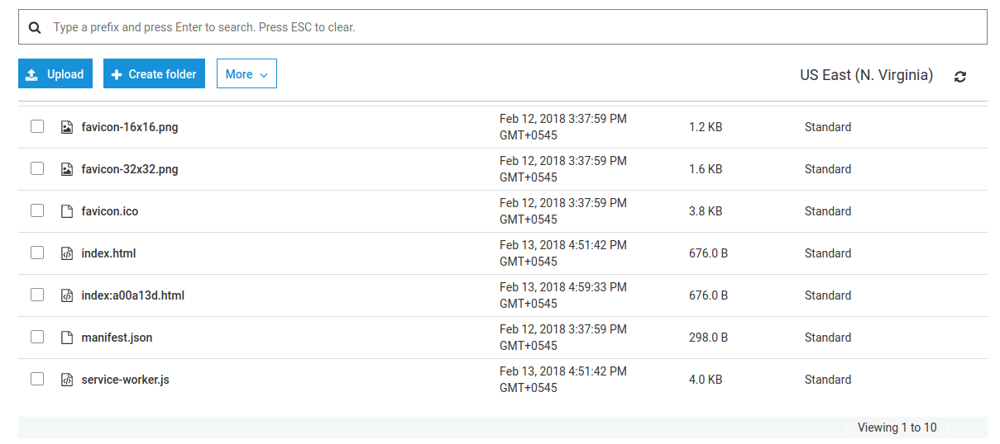
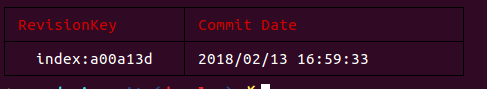

# react-deploy-cli

[](https://github.com/sumn2u/react-deploy-cli/issues) [](https://github.com/sumn2u/react-deploy-cli/network) [](https://github.com/sumn2u/react-deploy-cli/stargazers) [](https://github.com/sumn2u/react-deploy-cli/blob/master/LICENSE) [](https://twitter.com/intent/tweet?text=Wow:&url=https%3A%2F%2Fgithub.com%2Fsumn2u%2Freact-deploy-cli)

> Create React App deployment to S3 bucket along with revision update or last revision activate



> Activate any revisions




This package doesn't build the app, make sure you use webpack or create reat app to make the production build.

## Table of Contents

- [Install](#install)
- [Usage](#usage)
- [Contribute](#contribute)
- [License](#license)

## Install

```sh
npm i react-deploy-cli -S

# or

yarn add react-deploy-cli

```

## Usage
> react-deploy
```
 Usage: react-deploy [options] [command]

  Options:

    -V, --version               output the version number
    -h, --help                  output usage information

  Commands:

    init                        initialize configuration file for react-deploy
    deploy                      start to deploy dist folder to s3 bucket
    deploy                      deploy using different environments
    revisions                   display deployed revisions
    revisions [environment]     display deployed revisions on based of environment
    activate                    activate current file
    activate [environment]      activate file on based of environment
    list [options] [directory]
    help [cmd]                  display help for [cmd]

```

> react-deploy init
```
                              _                 _                  _                 
  _ __    ___    __ _    ___  | |_            __| |   ___   _ __   | |   ___    _   _ 
 | '__|  / _ \  / _` |  / __| | __|  _____   / _` |  / _ \ | '_ \  | |  / _ \  | | | |
 | |    |  __/ | (_| | | (__  | |_  |_____| | (_| | |  __/ | |_) | | | | (_) | | |_| |
 |_|     \___|  \__,_|  \___|  \__|          \__,_|  \___| | .__/  |_|  \___/   \__, |
                                                           |_|                  |___/ 

```


## Contribute


Small note: If editing the README, please conform to the [standard-readme](https://github.com/RichardLitt/standard-readme) specification. Contributors are welcome

## License

MIT © sumn2u